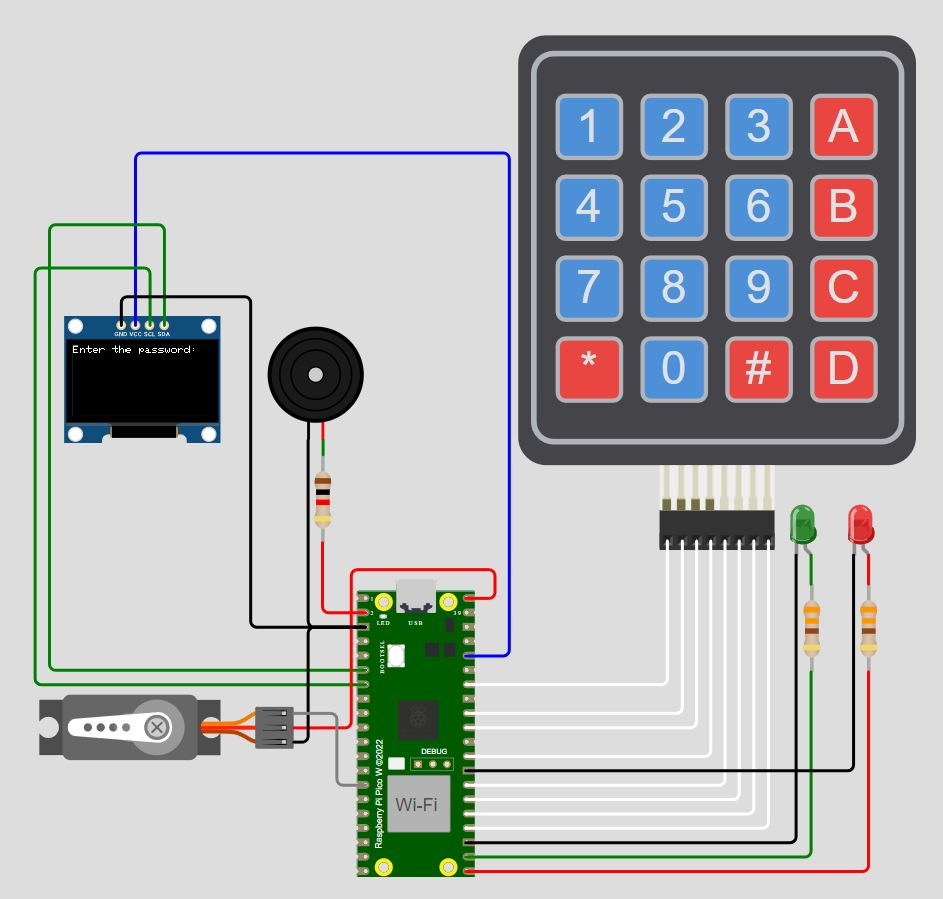
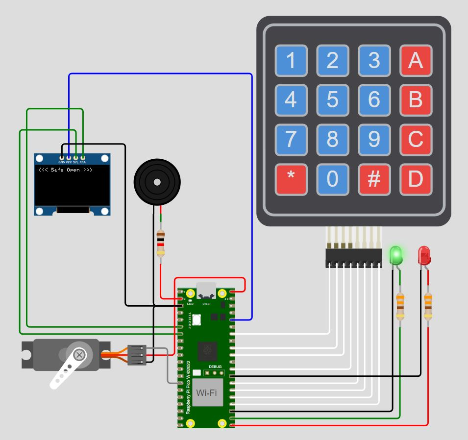
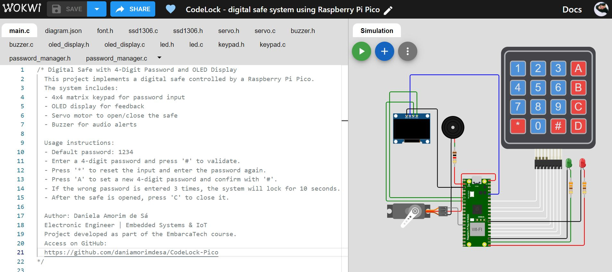

# CodeLock - Digital Safe with Raspberry Pi Pico W 🔒
**_Developed as a response to a challenge during the EmbarcaTech program._**  

## About the Project
CodeLock is a secure digital safe system developed as part of the EmbarcaTech course. It utilizes a Raspberry Pi Pico to implement password-based access control, featuring a 4x4 matrix keypad, OLED display, servo motor, and buzzer for feedback. The project is designed with a modular architecture for improved scalability and maintainability.



## Usage Instructions:
```
  - Default password: 1234
  - Enter a 4-digit password and press '#' to validate.
  - Press '*' to reset the input and enter the password again.
  - Press 'A' to set a new 4-digit password and confirm with '#'.
  - If the wrong password is entered 3 times, the system will lock for 10 seconds.
  - After the safe is opened, press 'C' to close it.
    
```

## What is EmbarcaTech? 
**EmbarcaTech** is a professional training program aimed at university students in Information and Communication Technology (ICT) and related areas, focusing on **Embedded Systems and Internet of Things (IoT)**. The program consists of two phases:

1. **Online Training (3 months)** – Covers concepts and practical development in embedded systems.
2. **Technology Residency (12 months)** – Practical application of knowledge in case studies and projects in fields such as education, security, industry, and healthcare.
   
This project is part of the first phase of the program, serving as a hands-on embedded systems development experience.

---

## Key Features
- 4-digit password authentication via a 4x4 matrix keypad.
- OLED display for real-time feedback.
- Servo motor to open and close the safe.
- Buzzer alerts for success, incorrect attempts, and system locking.
- Security lockout after three failed attempts (10s lock period).
- Password update functionality through a dedicated input mode.
- Modular software architecture for enhanced readability and maintainability.



---

## Components Used
- **Raspberry Pi Pico W**
- **4x4 Matrix Keypad**
- **OLED Display (SSD1306, I2C)**
- **Micro Servo Motor (SG90)**
- **Buzzer**
- **LED Indicators (Green & Red)**
    
---

##  Simulation  
Check out the full simulation on Wokwi by clicking [here](https://wokwi.com/projects/422850803418757121). 



---

## How to Run the Project
1. Clone this repository: 
   ```sh
   git clone https://github.com/daniamorimdesa/CodeLock-Pico.git

   ```
2. Open the project on [Wokwi](https://wokwi.com) or in your local development environment.
3. Compile and run the code. Ensure all required libraries are available.

---

## Project Structure

```
📂 CodeLock-Pico
├── main.c                   → Main program logic and control loop
├── password_manager.h/.c     → Password validation, management, and security lockout
├── keypad.h/.c               → Keypad scanning and input handling
├── oled_display.h/.c         → OLED screen functions for feedback and messages
├── servo.h/.c                → Safe door control using a servo motor
├── buzzer.h/.c               → Sound alerts for feedback and warnings
├── led.h/.c                  → LED indicator control for status feedback

```

- **main:** Implements the system loop and high-level logic.
- **password_manager:** Manages password validation, incorrect attempt tracking, and security lockouts.
- **oled_display:** Provides functions to display messages on the OLED screen.
- **keypad:** Handles keypad scanning and input detection.
- **servo**:  Controls the servo motor to open and close the safe.
- **buzzer:** Generates sound alerts based on different system events.
- **led:** Controls LED indicators to signal system states.
---

## Future Improvements
- Wi-Fi connectivity for remote unlocking via smartphone.
- Multiple user authentication with unique passwords.
- Integration with biometric sensors for added security.

---

## Complete Documentation
Detailed project documentation is available [here](https://github.com/daniamorimdesa/CodeLock-Pico/blob/main/CodeLock%20documentation.pdf).

---

## License
This project is licensed under the MIT License. See the LICENSE file for details.

---

##   Author
```
Daniela Amorim de Sá
Electronic Engineer  | Embedded Systems & IoT
Project developed as part of the EmbarcaTech course.
```
